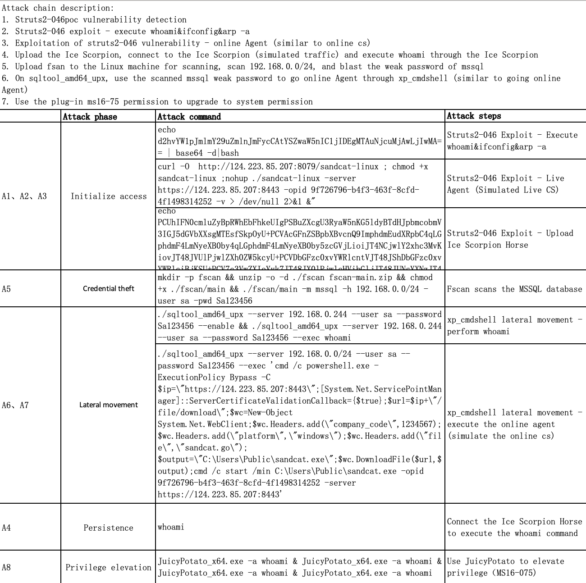
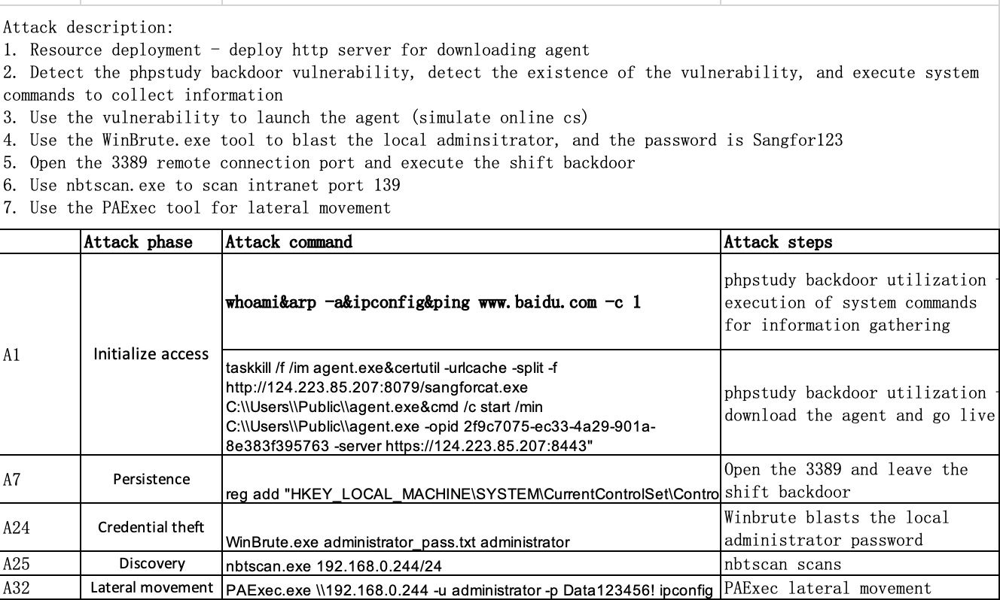
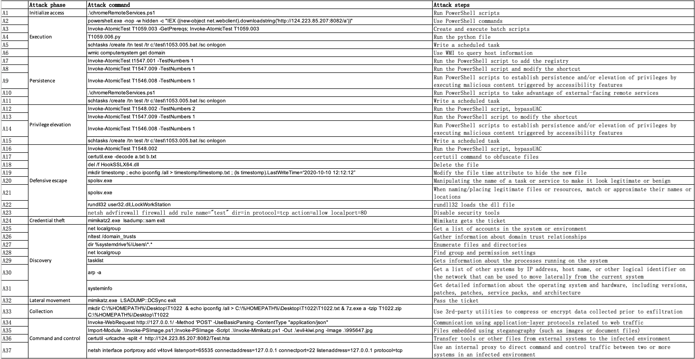
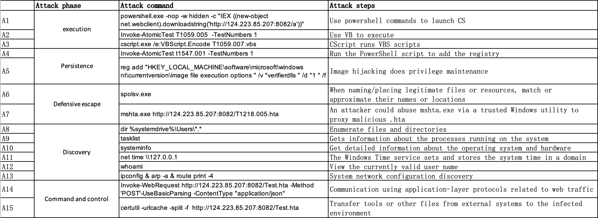
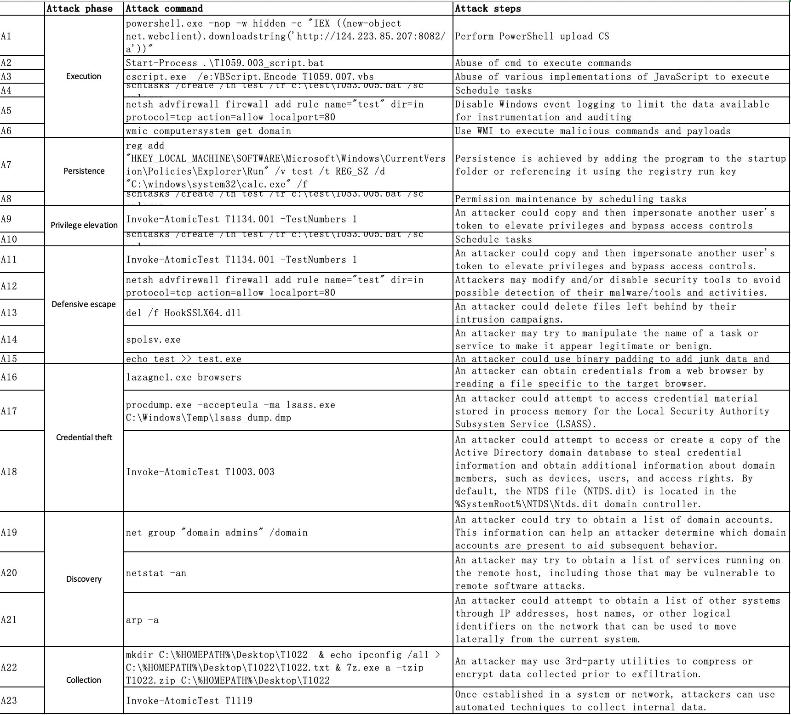

# reproducing NODLINK on three Simulated datasets

## Contributions

1. In `Simulated-Data/src/Sysdig/real-time/main.py` of the official GitHub repository of NODLINK, the node-level precision/recall calculating methods are vague. This repository contains the explicit TP/FP/TN/FN calculating methods according to my understanding of the paper.
2. In `ProvGraph.py`, hash ids in `self.attack_process`  are not exactly the same PROCESS nodes labeled as 'is_warn' in `anomaly.json`. I replace them with the actual nodes hash ids labeled as 'is_warn'.

## Usage

1. Config the environment and understand how to run NODLINK on 'SimulatedUbuntu' dataset according to the The official GitHub repository of NODLINK
2. train and test 'Ubuntu 20.04' dataset in `Simulated-Data/src/Sysdig/`
3. train and test 'Windows server 2012' and 'Windows 10' in `Simulated-Data/src/ETW/`

## My result

* hw17

  ```
  recall: 0.9375
  precision: 0.14705882352941177
  TP: 15
  FP: 87
  FN: 1
  TN: 377
  ```

* hw20

  ```
  recall: 0.9534883720930233
  precision: 0.10148514851485149
  TP: 41
  FP: 363
  FN: 2
  TN: 811
  ```

* win10

  ```
  recall: 0.8529411764705882
  precision: 0.15934065934065933
  TP: 116
  FP: 612
  FN: 20
  TN: 1663
  ```

* According to [Clarification on Result Aggregation for In-Lab Arena Dataset · Issue #15 · PKU-ASAL/Simulated-Data](https://github.com/PKU-ASAL/Simulated-Data/issues/15), NODLINK calculated the metrics by summed TP/FP/TN/FN before calculating overall precision and recall, so the final result:

  ```
  TP: 172
  FP: 1062
  FN: 23
  TN: 2851
  recall: 0.8821
  precision: 0.1394
  ```

---

# [NDSS 2024] NODLINK: An Online System for Fine-Grained APT Attack Detection and Investigation

This is an implementation of NodLink and the public Simulated datasets described in NDSS 2024 paper: [NODLINK: An Online System for Fine-Grained APT Attack Detection and Investigation](https://arxiv.org/abs/2311.02331).
## Simulated-Data
We carried out 5 attacks on three different hosts. The attack description and annotation are listed in the _doc_ folder.

### Simulate on Ubuntu
We carried out an attack on Ubuntu 20.04.



SimulatedUbuntu.zip  
$\qquad$ - hw17.zip  
$\qquad\qquad$ - benign.json  
$\qquad\qquad$ - anomaly.json  


### Simulate on Windows server 2012
We carried out an attack on Windows server 2012.


SimulatedWS12.zip  
$\qquad$ - hw20.zip  
$\qquad\qquad$ - benign.json  
$\qquad\qquad$ - anomaly.json  


### Simulate on Windows 10
We carried out three attacks on Windows 10.

#### APT29

#### Sidewinder

#### FIN6


SimulatedW10.zip  
$\qquad$ - win10.zip  
$\qquad\qquad$ - benign.json  
$\qquad\qquad$ - anomaly.json 

## NodLink
The prototype of NodLink is in the `src` directory. The `README.md` in it describes how to run our tool.

## ProvDetector
The prototype of our reimplementation of ProvDetector that is described in paper [You Are What You Do: Hunting Stealthy Malware via Data Provenance Analysis](https://kangkookjee.io/wp-content/uploads/2021/06/provdetector-ndss2020.pdf).


## Citations
If you use any of our tools or datasets in your research for publication, please kindly cite the following paper:
```
@inproceedings{Li_2024, series={NDSS 2024},
   title={NODLINK: An Online System for Fine-Grained APT Attack Detection and Investigation},
   url={http://dx.doi.org/10.14722/ndss.2024.23204},
   DOI={10.14722/ndss.2024.23204},
   booktitle={Proceedings 2024 Network and Distributed System Security Symposium},
   publisher={Internet Society},
   author={Li, Shaofei and Dong, Feng and Xiao, Xusheng and Wang, Haoyu and Shao, Fei and Chen, Jiedong and Guo, Yao and Chen, Xiangqun and Li, Ding},
   year={2024},
   collection={NDSS 2024} 
}
```

## Feedback
Should you have any questions, please post to [the issue page]([Issues · Nodlink/Simulated-Data (github.com)](https://github.com/Nodlink/Simulated-Data/issues)), or email Shaofei Li via lishaofei@pku.edu.cn.

## Acknowledgments
We would like to thank the anonymous reviewers for their valuable feedback and suggestions.

