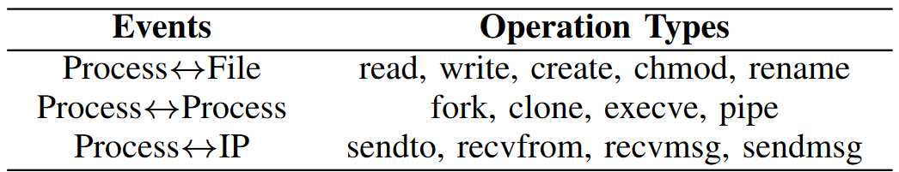

# 环境配置

```
conda create --name nodlink python=3.12
conda activate nodlink
pip install git+https://github.com/casics/nostril.git
pip install scikit-learn
pip install networkx
pip install gensim
pip install matplotlib
pip install pandas
pip install tqdm
pip install scipy==1.12
pip install seaborn
pip3 install torch torchvision torchaudio --index-url https://download.pytorch.org/whl/cu121
pip install streamz
pip install nearpy
pip install schedule
pip install pydot
```


# 复现

## Preprocessing the data

```
python process_behavior.py --file benign.json
python process_behavior.py --file anomaly.json
```

原始json文件数据存储格式：每行以字典格式存储一条系统日志

属性名	含义
evt.args	事件的参数，通常记录了与事件相关的具体信息
evt.num	事件编号，用于唯一标识每个事件
evt.time	事件发生的时间戳
evt.type	事件类型（如读取、写入、文件状态检查等）
fd.name	文件描述符的名称，通常是与事件相关的文件或设备的路径
proc.cmdline	进程命令行，表示触发该事件的进程及其命令行参数
proc.name	进程名称，表示触发该事件的进程的名称
proc.pcmdline	父进程命令行，表示触发该事件的进程的父进程及其命令行参数
proc.pname	父进程名称，表示触发该事件的进程的父进程的名称

---

用 NetworkX 库构建有向图，从原始日志构建来源图。来源图中：

* 结点类型：`PROCESS`, `FILE`, `NET`
* 边类型：PROCESS$\to$FILE, PROCESS$\to$PROCESS, PROCESS$\to$NET

根据 `evt.type` ，将日志分类为文件操作、进程操作、网络操作三种类型。

```
class APTLOG_TYPE:
    FILE_OP = ["read", "readv", "write", "writev", "fcntl", "rmdir", "rename", "chmod"]
    PROCESS_OP = ["clone", "pipe", "fork",'execve']
    NET_OP = ["sendmsg", "recvmsg", "recvfrom", "send", "sendto"]
```



* FILE_OP：提取：‘proc.cmdline’ 和 ‘fd.name’，构建有向边
* PROCESS_OP：提取：‘proc.pcmdline’ 和 ‘proc.cmdline’
* NET_OP：提取：‘proc.cmdline’ 和 ‘fd.name’

## 结点级特征嵌入

```
python filename-embedding.py
python cmdline-embedding.py
python caculate-weight.py
```

将文件名、命令行转换为语料库，通过 FastText 进行词向量学习。

## 离线训练

```
python train.py --epoch 50
```


## 在线检测

> 最初代码‘dataset’文件夹内需手动创建dot文件夹，已修补

```
cd real-time/
python main.py --t 24.77067108154297
```

